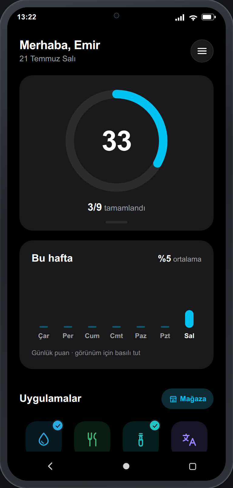
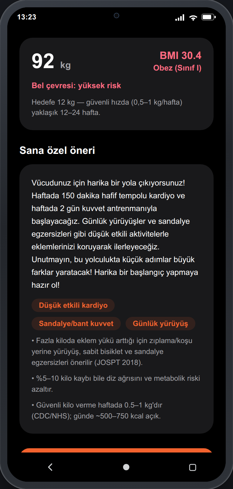
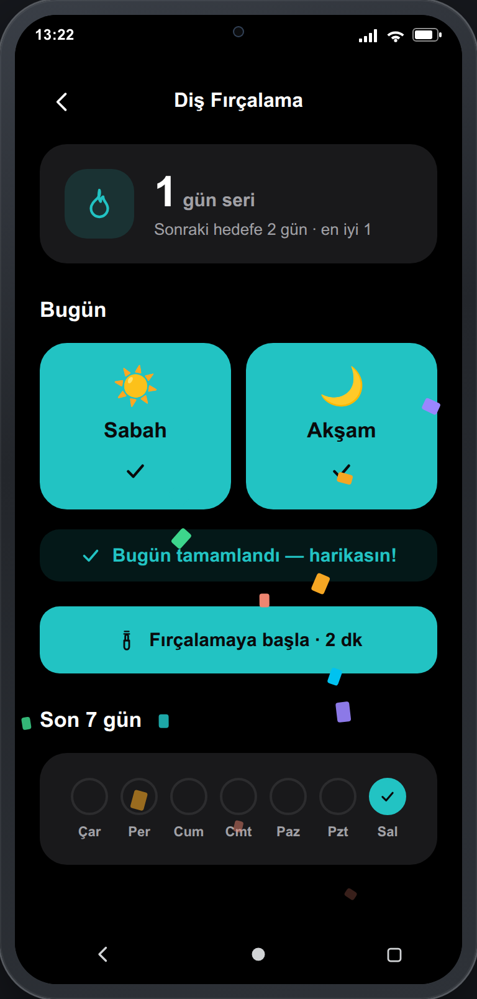
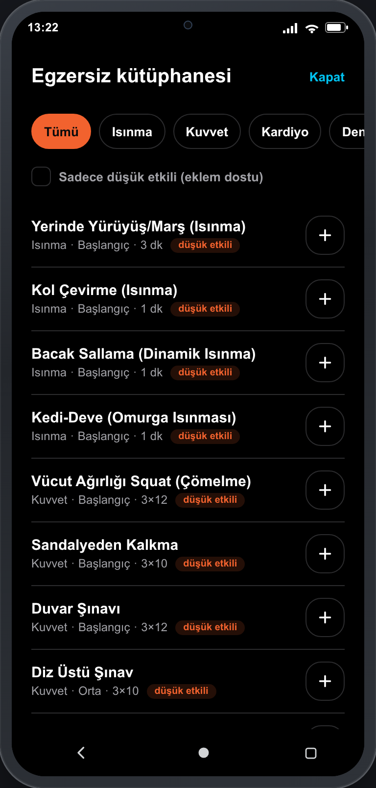

# sup-port

[](https://github.com/x3beche/sup-port/actions/workflows/ci.yml)

Kişisel gelişim için bir **superapp**. Tek bir uygulama içinde, alışkanlık ve gelişim
alanlarının her biri kendi modülü olarak yer alır — hepsi ortak bir kabuk, ortak bir
API ve ortak bir puanlama üzerinde çalışır.

Arayüz Samsung Health'in koyu temasından esinlenir: saf siyah zemin, yuvarlak koyu
kartlar, tepede günlük puan halkası, altında iOS uygulama seçme ekranı tarzında
modül ızgarası.

## Ekran görüntüleri

<p align="center">
  
  
  
  
</p>

## Modüller

| Modül | Varsayılan hedef | Ne yapar |
| --- | --- | --- |
| Su | 8 bardak | Günlük su takibi |
| Beslenme | 3 öğün | Öğün kaydı |
| Diş Fırçalama | 2 kez | Sabah/akşam yuvaları, seri ve 2 dk rehberli sayaç |
| İngilizce | 20 dk | Kelime ve tekrar çalışması |
| Egzersiz | 30 dk | Egzersiz kütüphanesi, BMI/vücut takibi, MET kalori, WHO haftalık hedef, yapay zekâ önerisi |
| Adım | 8000 adım | Günlük hareket |
| Uyku | 8 saat | Uyku süresi |
| Okuma | 30 dk | Kitap okuma süresi |
| Meditasyon | 10 dk | Zihin dinginliği |

Her modülün kendi **artış kademeleri** var (su +1/+2/+4, adım +500/+1000/+2500).
Kullanıcının en çok dokunduğu kademe sayılır ve arayüzde en geniş alanı alır.
Kutucuğa **basılı tutmak** modülü açmadan hızlı kayıt panelini açar; haftalık
grafiğe basılı tutmak görünümü puan/tamamlanan arasında değiştirir. Kutucuklar
**sürüklenerek yeniden sıralanabilir** (sıra sunucuda, kullanıcıya özel saklanır)
ve üstteki özet kartı tutamacından **büyük/kompakt** arasında boyutlandırılabilir
(bu tercih cihazda kalır).

### Uygulama mağazası

Modüller birer mini-uygulama gibi **kurulabilir ve kaldırılabilir**. Ana ekrandaki
"Mağaza"dan kategoriye göre listelenen uygulamalara girip Play Store tarzı bir
detay ekranından kurup kaldırabilirsin. Kaldırılan bir uygulama ana ekrandan ve
günlük puandan çıkar; geri kurulduğunda **verileri ve hedefi korunmuş** olarak
döner (kayıtlar hiç silinmez, yalnızca gizlenir). Yeni bir modül eklemek yine
`backend/app/modules.py` içine tek bir kayıt yazmaktır.

Sürükleme için ek bir kütüphane kullanılmadı; PanResponder ile yazıldı, böylece
web ve cihazda aynı çalışıyor ve native derleme zinciri değişmiyor. Dokunuş
modülü açmaya, uzun basış hızlı kayda devam ediyor — hareket 8 px eşiğini
aşmadan sürükleme sayılmıyor.

Hedefler **kullanıcıya özel**: her modülün ekranından kendi hedefini belirleyebilir
ya da varsayılana döndürebilirsin. Hedef değişince o günün tamamlanma durumu,
günlük puan ve geçmiş grafiğinin eşiği birlikte yeniden hesaplanır.

İkonlar emoji değil, `src/components/Icon.tsx` içinde tanımlı vektör çizimlerdir —
platformdan bağımsız görünür ve modülün rengini alır.

Yeni bir modül eklemek `backend/app/modules.py` içine tek bir satır eklemektir — API,
günlük puan ve ana ekran ızgarası hepsi bu listeden beslenir.

**Günlük puan**, her modülün `değer / hedef` oranının 1.0'da kırpılmış ortalamasıdır.
Kırpma bilinçli: tek bir modülde hedefi katlamak diğerlerinin eksiğini kapatamaz.

## Teknolojiler

- **Mobil / web:** Expo SDK 57, React Native 0.86, React 19, TypeScript
- **Backend:** FastAPI (Python 3.12), MongoDB Atlas, JWT + bcrypt
- **Test:** Playwright (API + arayüz)

Hedef cihaz: Samsung Galaxy S23 (1080×2340, DPR 3 → 360×780 mantıksal px).

### Hareket

Geçişler `src/components/ScreenTransition.tsx` üzerinden yürür: ekranlar sönümlenerek
ve hafifçe kayarak girer, geri dönüşte kayma yönü tersine döner. Ana ekrandaki modül
kutucukları sırayla yukarı süzülür, günlük puan halkası da sıfırdan hedefe doğru
dolarken sayı ona eşlik eder. Süreler `theme.motion` içinde tek yerden yönetilir —
160/240/420 ms ve `easeOutQuint` eğrisi; daha uzunu bir alışkanlık takipçisinde
ağır hissettiriyor.

### Oturum ve önbellek

Her uç nokta oturum ister; token `Authorization: Bearer` başlığıyla gider ve cihazda
saklanır. Çıkış yapmak token'ı **sunucu tarafında da iptal eder** (jti kara listesi,
kayıtlar token'ın kendi son kullanma tarihinde TTL indeksiyle silinir) — aksi halde
kopyalanmış bir token 30 gün boyunca hesabı değiştirebilirdi. Bir sekmede çıkış
yapıldığında diğer sekmeler de düşer.

Sayaç dokunuşları biriktirilip tek istekte gönderilir; ekrandan ayrılırken ya da
sayfa kapanırken bekleyen kayıt `keepalive` ile yine de gönderilir. Veriler API'den gelir ama önce yereldeki kopya çizilir
(*stale-while-revalidate*): uygulama açılışta anında dolu görünür, tazeleme arka
planda olur. Ağ yoksa önbellekteki veri kalır ve üstte uyarı şeridi çıkar.

## Kurulum

### 1. Yapılandırma

```bash
cp config.yaml.example config.yaml
```

`config.yaml` içine MongoDB bilgilerini ve bir `jwt_secret` yaz. Bu dosya
`.gitignore` içinde — gerçek kimlik bilgileri **asla** commit edilmez. Alternatif
olarak `MONGODB_URI`, `DB_NAME`, `JWT_SECRET` ortam değişkenleri de kullanılabilir;
ortam değişkenleri dosyadaki değerleri geçersiz kılar.

Secret üretmek için:

```bash
python3 -c "import secrets; print(secrets.token_urlsafe(48))"
```

### 2. Backend

```bash
cd backend
python3 -m venv .venv
.venv/bin/pip install -r requirements.txt
.venv/bin/uvicorn app.main:app --host 0.0.0.0 --port 4000
```

- API: `http://localhost:4000`
- Otomatik dokümantasyon: `http://localhost:4000/docs`
- Sağlık kontrolü: `http://localhost:4000/health`

### 3. Uygulama

```bash
npm install
npx expo start
```

- Web: `http://localhost:8081` (port doluysa Expo başka bir port önerir)
- **S23 çerçeveli önizleme:** `http://localhost:8081/s23.html`
- Cihazda: Expo Go ile aynı Wi-Fi ağından bağlan

> Kök adres uygulamayı çerçevesiz gösterir. Telefon çerçevesi içinde görmek için
> `/s23.html` adresini aç.

Uygulama API adresini kendisi bulur: web'de sayfanın host'u, cihazda Metro'nun
sunulduğu LAN adresi kullanılır. Elle vermek için `EXPO_PUBLIC_API_URL` tanımla.

## API

| Uç nokta | Açıklama |
| --- | --- |
| `POST /api/auth/register` | Kayıt, token döner |
| `POST /api/auth/login` | Giriş, token döner |
| `GET /api/auth/me` | Oturumdaki kullanıcı |
| `GET /api/modules` | Modül kaydı |
| `GET /api/targets` | Kişisel hedefler (varsayılanla birlikte) |
| `PUT /api/targets/{modül}` | Kendi hedefini belirle |
| `DELETE /api/targets/{modül}` | Varsayılan hedefe dön |
| `GET /api/summary?date=` | Günlük puan ve modül ilerlemeleri |
| `GET /api/summary/week?days=` | Haftalık puan serisi (grafik için) |
| `GET /api/store` | Tüm uygulamalar + kurulu bayrağı |
| `POST /api/store/{app}/install` | Uygulamayı kur |
| `DELETE /api/store/{app}/install` | Uygulamayı kaldır |
| `GET /api/order` | Kullanıcının modül sırası |
| `PUT /api/order` | Izgara sırasını kaydet |
| `POST /api/auth/logout` | Oturumu sunucu tarafında iptal eder |
| `PUT /api/entries/{modül}` | Değeri doğrudan ayarla |
| `POST /api/entries/{modül}/add` | Değeri artır/azalt |
| `GET /api/history/{modül}?days=` | Kesintisiz günlük seri |

`/health` dışındaki tüm uçlar oturum ister. Tarih parametresi istemcinin **yerel**
takvim gününü taşır; gece 01:00'de girilen kayıt o güne yazılsın diye.

## APK derleme

Yerel Android araç zinciriyle (Android Studio SDK + JDK) release APK:

```bash
EXPO_PUBLIC_API_URL=http://<makine-lan-ip>:4000 bash scripts/build-apk.sh
```

Çıktı `dist/sup-port-<sürüm>.apk` olur. **Önemli:** bağımsız APK, backend'e
derleme anında gömülen adresten bağlanır — telefon o adresle aynı ağda olmalı ve
backend çalışıyor olmalıdır. Gerçek yayın için backend'in herkese açık bir
sunucuya deploy edilmesi gerekir.

Alternatif olarak bir `v*` tag'i push'lamak `.github/workflows/release.yml`
üzerinden CI'da APK derleyip GitHub Release'e ekler.

## Sürekli entegrasyon

`.github/workflows/ci.yml` her push ve pull request'te çalışır:

- **verify:** TypeScript tip kontrolü, kendi MongoDB servis konteynerini ayağa
  kaldırır, backend ve web sunucusunu başlatır, Playwright testlerinin tamamını
  koşar. Hata durumunda sunucu loglarını basar, test raporunu artefakt olarak yükler.
- **secrets-guard:** `config.yaml`'ın depoya girmediğini, örnek dosyanın var
  olduğunu ve takip edilen hiçbir dosyada canlı MongoDB bağlantı dizesi
  bulunmadığını doğrular.

CI Atlas'a bağlanmaz; kendi `mongo:7` servisini ve tek kullanımlık bir
`JWT_SECRET` değerini kullanır, yani depoda hiçbir gerçek kimlik bilgisi gerekmez.

## Testler

```bash
npx playwright test          # tümü
npx playwright test --ui     # arayüzle
```

Testler `tests/` altında, Playwright çıktıları `tests/.artifacts` ve `tests/.report`
klasörlerine yazılır. API testleri çalışan bir backend bekler. Farklı adresler için
`WEB_URL` ve `API_URL` ortam değişkenlerini kullan.

## Proje yapısı

```
App.tsx                       kabuk ve ekran geçişi
src/theme.ts                  koyu tema belirteçleri
src/lib/api.ts                API istemcisi, adres çözümleme
src/lib/useCachedQuery.ts     stale-while-revalidate önbellek
src/context/AuthContext.tsx   oturum durumu
src/components/               ScoreRing, ModuleTile
src/screens/                  Auth, Home, Module
public/s23.html               S23 çerçeveli önizleme
backend/app/modules.py        modül kaydı — yeni modül buraya
backend/app/targets.py        kullanıcıya özel hedef çözümleme
backend/app/routers/          auth, tracker
tests/                        Playwright testleri
```

## Mimari notu

Mobil uygulama MongoDB'ye **doğrudan bağlanmaz**. Tüm veri erişimi FastAPI katmanı
üzerinden gider; aksi halde veritabanı kimlik bilgisi uygulama paketinin içine
gömülür ve paketi açan herkes tarafından okunabilir.

Auth şu an kendi JWT uygulamamız. Clerk/Auth0 gibi bir sağlayıcıya geçmek istenirse
değişmesi gereken tek yer `backend/app/security.py` ve `backend/app/deps.py`.
